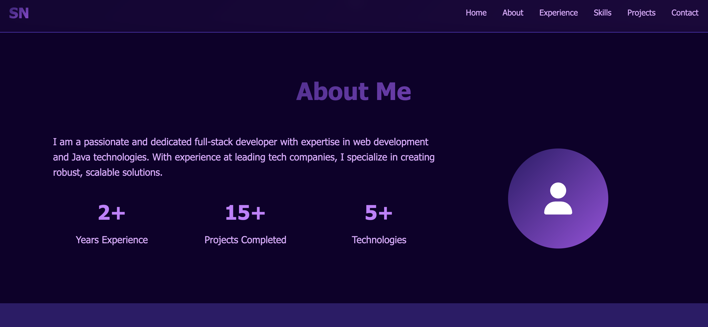

# 🌐 Sarang Nayak Portfolio

[](LICENSE)  
  
  
  


---

## 🚀 Live Site  
🔗 [sarangnayak.github.io/sarang-portfolio1](https://sarangnayak.github.io/sarang-portfolio1/#hero)

---

## 🖼 Preview

  

---

## ✨ About

This is my personal portfolio site built to showcase my skills, experience, and projects.  
The **Hero section** sets the tone with a strong intro:  
> **Sarang Nayak** — Full-Stack Developer & Problem Solver  
> Crafting digital experiences with cutting-edge technology

---

## 🛠 Features

- Responsive hero section with clear typography  
- Navigation anchoring to sections (Home, About, Experience, Skills, Projects, Contact)  
- Smooth scrolling (if implemented)  
- Clean content layout for "About Me", "Experience", "Skills", "Projects", "Contact"  
- Minimalistic design with focus on content  

---

## 📂 Folder Structure
```
sarang-portfolio1/
│
├── index.html        # Main markup
├── style.css         # Styling, layout, animations
├── script.js         # (Optional) JS for scroll or interactivity
└── assets/            # Images, icons, preview screenshots

```
---

## 📥 Usage / Setup

1. Clone the repository  
   ```bash
   git clone https://github.com/sarangnayak/sarang-portfolio1.git
   cd sarang-portfolio1
   
🧩 Customization Ideas
	•	Add smooth scroll or scroll reveal animations
	•	Add a dark / light mode toggle
	•	Add interactive elements in hero (typed text, dynamic effects)
	•	Animate section transitions
	•	Add backend contact form (using email API)

⸻

🤝 Contributing

Contributions are welcome:
	•	Fork the repo
	•	Create a feature branch
	•	Make your changes
	•	Submit a Pull Request

⸻

📜 License

This project is licensed under the MIT License.
See the LICENSE file for details.

⸻

👤 Author

Sarang Nayak
🔗 GitHub
🌐 Portfolio
