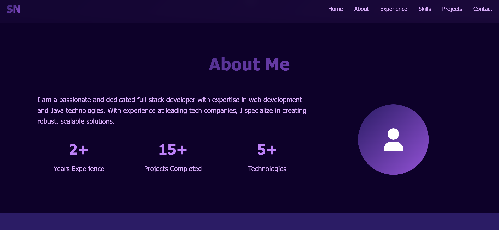

# Sarang Portfolio Website

A personal portfolio website built using **HTML, CSS, and JavaScript** to showcase projects, skills, hobbies, and contact information. The website is fully static and deployed using **GitHub Pages**.

---

## 🌐 Live Demo

🔗 Website:  
https://sarangnayak.github.io/sarang-portfolio1/

---

## 📁 Project Structure

sarang-portfolio1/
│
├── assets/          # Images and static assets
├── index.html       # Main landing page
├── hobbies.html     # Hobbies and interests page
├── 1contact.html    # Contact page
├── style.css        # Global styles
├── script.js        # JavaScript for interactivity
├── preview.png      # Website preview image
└── README.md        # Project documentation

---

## ✨ Features

- Responsive and clean UI design
- Multi-page static website
- Custom styling using CSS
- Client-side interactivity with JavaScript
- Deployed via GitHub Pages
- Simple and easy to customize

---

## 🛠 Technologies Used

- HTML5
- CSS3
- JavaScript
- GitHub Pages

---

## 🚀 Deployment

This project is deployed using **GitHub Pages**.

Steps used:
1. Push code to the `main` branch
2. Go to repository **Settings**
3. Navigate to **Pages**
4. Select `main` branch as source
5. Save and access the live URL

---

## 📸 Preview

---

## 📬 Contact

For feedback, collaboration, or opportunities, please use the contact page on the website.

---

## 📄 License

This project is open-source and available for personal and educational use.

---

© 2025 Sarang Nayak
